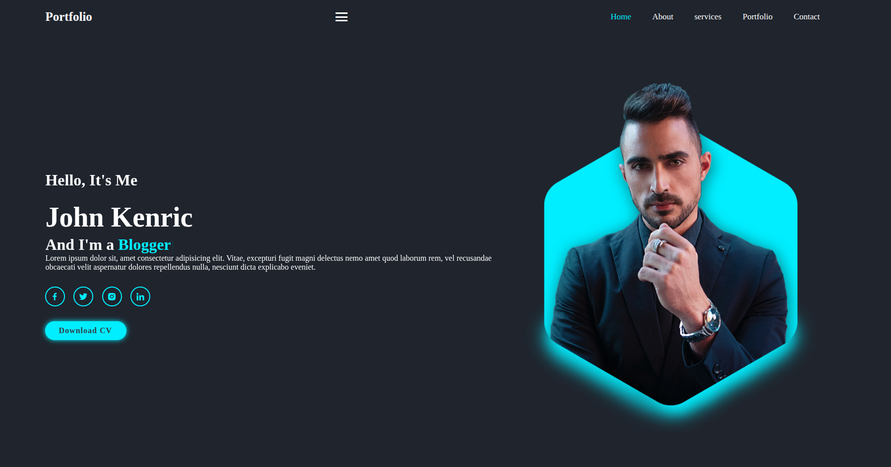
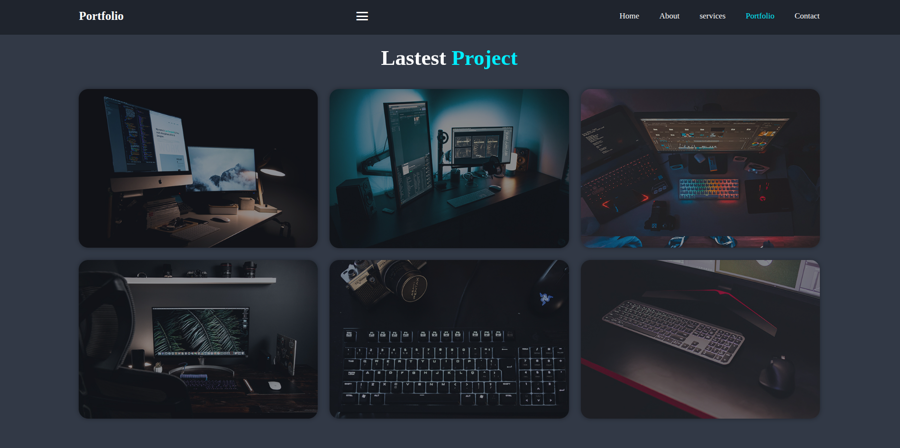

# Personal Portfolio — Robson Monteiro

> Personal website showcasing my profile, skills, and projects as a software developer.

<!-- Live Demo: (GitHub Pages URL will be added here) -->

<!-- Example: https://robsonmonteirolacerda.github.io/personal-portfolio-site -->

---

## 🚀 About the Project

This repository contains my **personal portfolio website**, created to present my professional profile, technical skills, and projects in a clear and objective way.

The goal of this project is not only visual presentation, but also to demonstrate:

* Code organization
* Clarity of structure
* Good front-end practices
* Professional project documentation

It serves as a central hub to showcase my work and connect with recruiters, developers, and collaborators.

---

## 🧠 About Me

Software Developer focused on building **corporate and administrative systems**, with experience in:

* Legacy environments (Java EE / Java 7)
* Application modernization
* Backend architecture with Spring Boot
* Modern frontend development with React

Strong focus on:

* Business rules clarity
* Clean and organized code
* Sustainable and maintainable solutions
* Continuous technical evolution

---

## 🛠 Tech Stack

**Frontend:**

* HTML5
* CSS3
* JavaScript (Vanilla JS)

**Tools:**

* Git
* GitHub
* VS Code

---

## ✨ Features

* Responsive layout
* Clean and minimalist UI
* Personal presentation
* Skills section
* Project showcase section
* Contact section

---

## 📁 Project Structure

```bash
personal-portfolio-site/
│
├── index.html
├── css/
│   └── style.css
├── js/
│   └── script.js
├── images/
│   └── (assets and images)
└── README.md
```

---

## 📸 Screenshots

<!-- Screenshot placeholders -->

<!--  -->

<!--  -->

<!--  -->

---

## 🌐 Live Demo

<!-- GitHub Pages URL will be added here -->

<!-- Example: https://robsonmonteirolacerda.github.io/personal-portfolio-site -->

---

## 🚀 How to Run Locally

You can run the project locally by simply opening the `index.html` file in your browser:

```bash
# clone the repository
git clone https://github.com/robsonmonteirolacerda/personal-portfolio-site.git

# open the folder
cd personal-portfolio-site

# open index.html in your browser
```

---

## 📫 Contact

* 💼 LinkedIn: [https://www.linkedin.com/in/robson-monteiro-39075a1a1/](https://www.linkedin.com/in/robson-monteiro-39075a1a1/)
* 💻 GitHub: [https://github.com/robsonmonteirolacerda](https://github.com/robsonmonteirolacerda)

<!-- - 📧 Email: robsonmonteiro_ads@gmail.com -->

---

## ⭐ Purpose

This project is part of my professional portfolio and represents my journey as a developer focused on:

* Code quality
* System organization
* Technical growth
* Real-world software development

---

> "Simple, well-structured, and maintainable software scales better than complex solutions."
